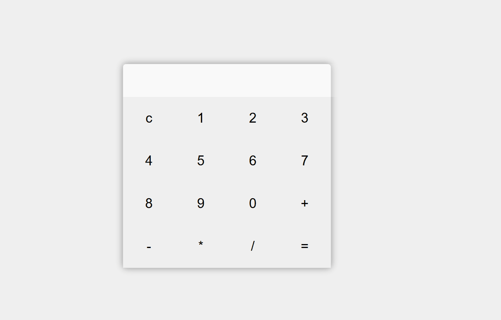

 Проект "Калькулятор"
<<<<<<< HEAD
=======

# Описание проекта
В данном проект показывает алгоритм работы калькулятора.

# Цели проекта
Проект реализован для того чтобы показать работу калькулятора.

# Используемые технологии
Для отображеня всплывающих окон используется HTML5,
JavaScript для реализациии функции проекта.

# Описание основных функций
`function clearDisplay()` - удаяет все символы из дисплей.

`function appendNumber(number)` - добавляет числа на дисплей.

`function calculatorResult()` - выводит результат арифметичеких действий.

`function appendOperator(operator)` -  добавляет символы на дисплей.

# Пример запуска
Для запуска проекта для начала вам необходимо его скачать после чего запустить файл index.html.

Проект выполнен в образовательных целях на онлайн-курсе "Основы WEB-разработки" школы "Лидер".

>>>>>>> 8961c514831e951c262623289cc9e16f45e107fc

# Описание проекта
В данном проект показывается работа калькулятора.

# Цели проекта
Создание калькулятора.

# Используемые технологии
Для отображеня всплывающих окон используется HTML5,
JavaScript для реализациии функции проекта.

# Описание основных функций
`function clearDisplay()` - удаяет все символы из дисплей.

`function appendNumber(number)` - добавляет числа на дисплей.

`function calculatorResult()` - выводит результат арифметичеких действий.

`function appendOperator(operator)` -  добавляет символы на дисплей.

# Пример запуска
Для запуска проекта для начала вам необходимо его скачать после чего запустить файл index.html.

Проект выполнен в образовательных целях на онлайн-курсе "Основы WEB-разработки" школы "Лидер".
